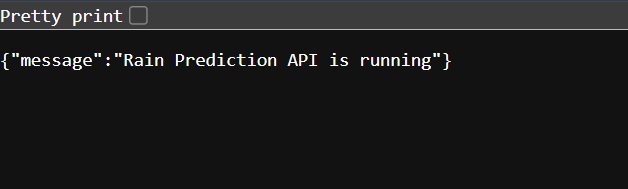

> An end-to-end, production-ready machine learning system that predicts rainfall for the next day using structured weather observations — built with engineering discipline, not just model accuracy.

---

## Try now! Links
1. App: https://rainfall-prediction-app1.streamlit.app 
2. API: https://rain-prediction-api.onrender.com


## What This Project Actually Is

Most ML projects stop at a Jupyter notebook. This one does not.

This system takes a trained XGBoost model and wraps it inside a proper software architecture — a validated REST API, a clean interactive frontend, a preprocessing pipeline, and a deployment-ready structure. Every component has a defined responsibility. **_Every input is validated. Every prediction is controlled._**

This is the difference between a data science exercise and an ML engineering project.

---

## System Architecture


---

## Core Stack

| Layer | Technology | Purpose |
|---|---|---|
| Algorithm | XGBoost Classifier | Gradient-boosted ensemble for tabular data |
| Preprocessing | Sklearn Pipeline (Median Imputer + StandardScaler) | Consistent train-inference behavior |
| API | FastAPI + Pydantic | High-performance REST API with strict validation |
| Frontend | Streamlit | Interactive real-time prediction UI |
| Serialization | Pickle | Packaged model + threshold + feature names |
| Logging | Python `logging` | Runtime observability |

---

## Features That Reflect Production Thinking

**Feature-Name Controlled Ordering**
The model package stores feature names alongside the model. At inference time, the API reorders input features to match the exact training order. This eliminates silent prediction corruption — a real bug that breaks systems in production when feature order shifts.

**Custom Probability Threshold**
Instead of using the default 0.5 threshold, this system tunes and stores a **_custom threshold of 0.45_** during training. This enables precision-recall tradeoff control — critical in real forecasting systems where the cost of false negatives differs from false positives.

**Sklearn Pipeline Encapsulation**
Preprocessing is not done separately before inference. The entire preprocessing chain — imputation, scaling — lives inside the pipeline. The API applies identical transformations to incoming data as were applied during training. No data leakage risk. No inconsistency.

**Pydantic Schema Validation**
The API enforces strict input validation — exactly 21 features required, all float type, structured as a named dictionary. Malformed requests are rejected before they touch the model.

**Startup Model Loading**
The model is loaded once at server startup, not on every request. This is standard production practice for low-latency inference.

**Separation of Concerns**
- Model logic lives inside the pipeline
- API handles validation and routing
- UI handles user interaction only

No layer crosses into the responsibility of another.

---

## Project Structure

```
rain-prediction-system/
│
├── main.py                  # FastAPI backend — prediction API
├── app.py                   # Streamlit frontend — interactive UI
├── rain_model_3.pkl         # Packaged model (model + threshold + feature_names)
├── requirements.txt
└── README.md
```

---

## Input Features (21 Total)

| Feature | Description |
|---|---|
| MinTemp, MaxTemp | Daily temperature range |
| Rainfall | Amount of rainfall recorded |
| Evaporation | Daily evaporation |
| Sunshine | Hours of sunshine |
| WindGustSpeed | Maximum wind gust speed |
| Pressure_mean, Pressure_diff | Derived: mean and difference of 9am/3pm pressure |
| WindSpeed_mean, WindSpeed_diff | Derived: mean and difference of wind speeds |
| Humidity_mean, Humidity_diff | Derived: mean and difference of humidity readings |
| Cloud_mean, Cloud_diff | Derived: mean and difference of cloud cover |
| Temp_range, Temp_diff | Derived: temperature spread features |
| Month | Month of the year (seasonal encoding) |
| WindDir9am_angle, WindDir3pm_angle | Wind direction as continuous angle |
| WindGustDir_angle | Gust direction as continuous angle |
| ClimateZone | Regional climate classification |

Derived features were engineered to reduce noise from individual time-point readings and expose stronger signal to the model.

---
## UI Interface


<!--  -->

## API Reference

**Response:**


### `POST /predict`
Returns prediction and probability for tomorrow's rainfall.

**Request Body:**
```json
{
  "features": {
    "MinTemp": 15.0,
    "MaxTemp": 25.0,
    "Rainfall": 1.0,
    ...
  }
}
```

**Response:**


**Validation:** Exactly 21 named features required API will calculate other. All values must be float. Missing or extra features return HTTP 400 with a clear error message.

---

## What This Project Demonstrates

This project is evidence of the following engineering capabilities:

1. **End-to-end ML system design** — from raw data and training to packaged model, deployed API, and live frontend
2. **Production-grade API development** — request validation, error handling, structured response schema, startup lifecycle management
3. **ML engineering discipline** — pipeline encapsulation, threshold tuning, feature consistency enforcement
4. **Software architecture thinking** — separation of concerns across model, API, and UI layers
5. **Feature engineering judgment** — deriving signal-rich aggregated features from raw time-point observations

---

## Author

**Pradip Pawar**
ML and Data Science Engineer

Building toward a future in AI/ML and Data Science through disciplined, sequential learning and real-world projects.

---

> *Built with XGBoost, FastAPI, Streamlit, and engineering intent.*